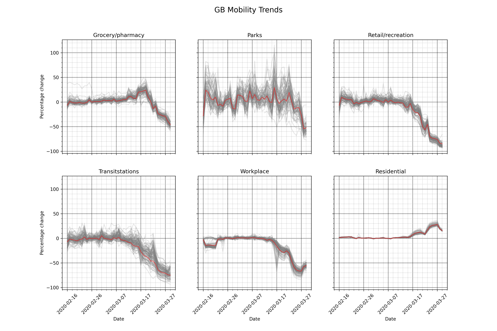

# Google Mobility data for covid19


This repository contains code to pull data out of the [Google Community Mobility reports](https://www.google.com/covid19/mobility/) pdfs into a usable format for modelling. Currently the exported format is JSON. 

It also contains pre preprocessed data for all countries, plus US states. This data is extracted from all plots, so at both national and regional level.

## Data Extracted
The reports contain time series data for the relative reduction in attendance to the following type of venue:
- Retail & recreation
- Grocery & pharmacy
- Parks
- Transit stations
- Workplace
- Residential

In some of the plots from the reports, data is either entirely missing, or incomplete. In these cases the data is not extracted.

Each country/state has 3 files, one containing the state level aggregate data, one, where available, containing data broken down at a county/province/region level, and a final one containing both. If there is no breakdown into smaller regions for a given state, then the corresponding file will not exist.

There is also files that contain this information for all countries together in the top level folder.

Data is presented in two formats. One is more useful for standard data analysis. Files in this form have `_normal` appended to their file name. The form of this data is:

| state | county | category | 28-02-2020 | 29-02-2020 | ... |
| --- | --- | --- | --- | --- | --- |
|GB|Ards And North Down|grocery/pharmacy|-5.351|-0.801| ... |

The second is useful for using this data as a covariate in a model. The format of this data is:
|state|county|date|grocery/pharmacy|parks|residential|retail/recreation|transitstations|workplace|
| --- | --- | --- | --- | --- | --- | --- | --- | --- |
|GB|Ards And North Down|2020-02-16|-5.351|-10.921||-2.104|-8.681|-3.453|


State refers to the larger size area, country a smaller region of this. For most places this is the country and then the regions within it. For US states this is the state and the counties in each state (there are files for each US state, and for the US itself, broken down by state).


## Example
Here is an example of the data extracted for the United Kingdom. Red line is the nation overall, gray are individual counties (Plot made by [this notebook](plots/test_plots.ipynb)).



## Usage

Data is organised into folders by date of publication and country/state code. For example to get the data for the UK (ISO code GB):
```
https://github.com/MJHutchinson/covid19-google-mobility-extractor/blob/master/data/2020-03-29/GB/2020-03-29_GB_GB_normal.json
```
To download the raw file, you can use a command like `wget` or `curl` on the raw data link. This raw link will look like:
```
https://raw.githubusercontent.com/MJHutchinson/covid19-google-mobility-extractor/master/data/2020-03-29/GB/2020-03-29_GB_GB_normal.json
```

#### CSV data
The data is also available in csv format. The paths are the same, with the `.csv` extension

## Running yourself
If you would like to extract the data yourself, simply run [download_pdfs.sh](download_pdfs.sh) and [make_data.sh](make_data.sh). You may need to update the date in these files when Google updates their reports.

### Country Codes
Google identifies countries by a 2 letter ISO code. The file [codes_to_names.txt](codes_to_names.txt) maps between these and country names.

## Any Questions?
If there's anything I've missed, or you would like the data in a different format, let me know, or open a pull request/issue!

## Acknowlagments
The code in this repo is in part based of [this Reddit post](https://www.reddit.com/r/datasets/comments/fuo64p/google_covid19_mobility_reports_time_series_data/?utm_source=share&utm_medium=ios_app&utm_name=iossmf).